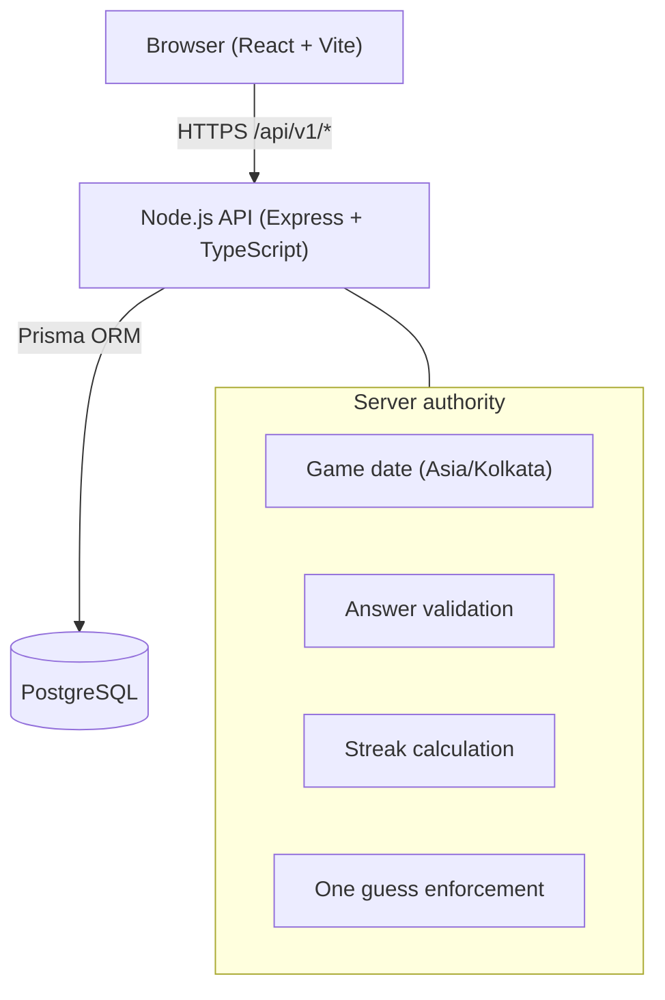

# Streak

One puzzle a day. One guess. Keep your streak alive.

**Live deployment (placeholders — update after deploy):**

| Service | URL |
|---|---|
| Frontend | https://streak-green-three.vercel.app/ |
| Backend API | https://streak-backend-ly90.onrender.com |
| Health Check | https://streak-backend-ly90.onrender.com/health |

## Architecture



## Tech stack

| Layer    | Stack |
|----------|-------|
| Frontend | React 19, TypeScript, Vite, Luxon |
| Backend  | Node.js, Express, TypeScript, Zod, Luxon, Helmet |
| Database | PostgreSQL, Prisma |
| Tests    | Vitest, Supertest |

## Local setup

### Prerequisites

- Node.js 18+
- PostgreSQL 14+ (or Docker — see `docker-compose.yml`)

### 1. Database

```bash
# Option A — Docker
docker compose up -d

# Option B — local PostgreSQL
psql -U postgres -c "CREATE DATABASE streak;"
```

### 2. Backend

```bash
cd backend
cp .env.example .env
# Edit DATABASE_URL if needed

npm install
npx prisma migrate deploy
npm run db:seed
npm run dev
```

API: `http://localhost:3000`

### 3. Frontend

```bash
cd frontend
cp .env.example .env

npm install
npm run dev
```

App: `http://localhost:5173`

## Production configuration

### Backend (`backend/.env`)

| Variable | Required | Description |
|----------|----------|-------------|
| `DATABASE_URL` | Yes | PostgreSQL connection string |
| `NODE_ENV` | **Yes** | Must be `production` in deploy — enables rate limits + Helmet |
| `CORS_ORIGIN` | **Yes** | Deployed frontend URL (e.g. `https://streak.vercel.app`) |
| `PORT` | No | Default `3000` (Render sets this automatically) |

### Frontend (`frontend/.env`)

| Variable | Required | Description |
|----------|----------|-------------|
| `VITE_API_BASE_URL` | **Yes** | Deployed backend URL (no trailing slash) |

### Security decisions

- **Server-authoritative game logic** — client never determines correctness, streak, or game date
- **Answer secrecy** — answer omitted from GET `/game/today` before play; returned only after attempt is recorded
- **One guess** — enforced in UI, API, and `UNIQUE(player_id, puzzle_id)` constraint
- **Idempotent retries** — duplicate POST returns the original committed result
- **Transactional writes** — attempt + streak update in a single DB transaction
- **Rate limiting** — active when `NODE_ENV=production` (5 player creates/min, 10 guesses/min per IP)
- **Helmet** — security headers enabled in production
- **No SQL logging in production** — Prisma logs errors only (queries contain puzzle answers)
- **CORS** — restricted to `CORS_ORIGIN` in production; permissive localhost in development

## Deployment

### Recommended stack

1. **Database** — Supabase PostgreSQL or Render PostgreSQL
2. **Backend** — Render Web Service
   - Build: `npm install && npx prisma migrate deploy && npm run build`
   - Start: `npm start`
   - Env: `DATABASE_URL`, `NODE_ENV=production`, `CORS_ORIGIN`
3. **Frontend** — Vercel
   - Root: `frontend/`
   - Build: `npm run build`
   - Env: `VITE_API_BASE_URL=https://your-api.onrender.com`

### Post-deploy checklist

- [ ] `GET /health` returns `{"status":"ok"}`
- [ ] Frontend loads from deployed URL
- [ ] CORS allows frontend → API requests
- [ ] Create player, play puzzle, refresh — state persists
- [ ] Second guess same day is rejected/idempotent
- [ ] Network tab shows no answer before submission

## Manual smoke-test checklist

- [ ] **First visit** — enter name, land on today's puzzle
- [ ] **Submit correct** — streak increments, result shown, confetti (if motion allowed)
- [ ] **Submit wrong** — streak resets, answer revealed
- [ ] **Refresh after play** — completed state persists
- [ ] **Close/reopen browser** — same player UUID from localStorage
- [ ] **Double-click submit** — only one attempt recorded
- [ ] **Network failure** — error shown, "Try again" resubmits same guess safely
- [ ] **Missed day** — banner shown, streak displays 0 before play
- [ ] **Countdown** — ticks down to Kolkata midnight, new day loads after rollover
- [ ] **Mobile 320px** — layout usable, inputs accessible
- [ ] **Keyboard** — tab through form, submit with Enter

## API overview

| Method | Path | Description |
|--------|------|-------------|
| POST | `/api/v1/players` | Create anonymous player |
| GET | `/api/v1/game/today?playerId=` | Today's puzzle + status |
| POST | `/api/v1/game/guess` | Submit daily guess |
| GET | `/api/v1/players/:id/stats` | Player statistics |
| GET | `/health` | Health check |

## Testing

Tests use a **separate database** (`streak_test`) so `npm test` never overwrites development puzzle data.

```bash
cd backend
cp .env.test.example .env.test
# Edit DATABASE_URL if needed, then create the test database once:
psql -U postgres -c "CREATE DATABASE streak_test;"

npm test        # migrates streak_test, then runs integration + unit tests
npm run build
```

`backend/.env` → development / manual QA (`streak`).  
`backend/.env.test` → isolated test database (`streak_test`).

```bash
cd frontend
npm run build
npm run lint
```

## Project layout

```
Streak/
├── backend/          # Express API, Prisma, streak engine
├── frontend/         # React game UI
├── docker-compose.yml
└── README.md
```

## Tradeoffs

- Anonymous UUID identity (no auth) — simple onboarding, multiple identities possible
- In-memory rate limiter — fine for single-instance; use Redis for multi-instance
- Dynamic streak display — no cron jobs; DB `currentStreak` may lag until next play
- Puzzles via seed script — no admin UI in V1
